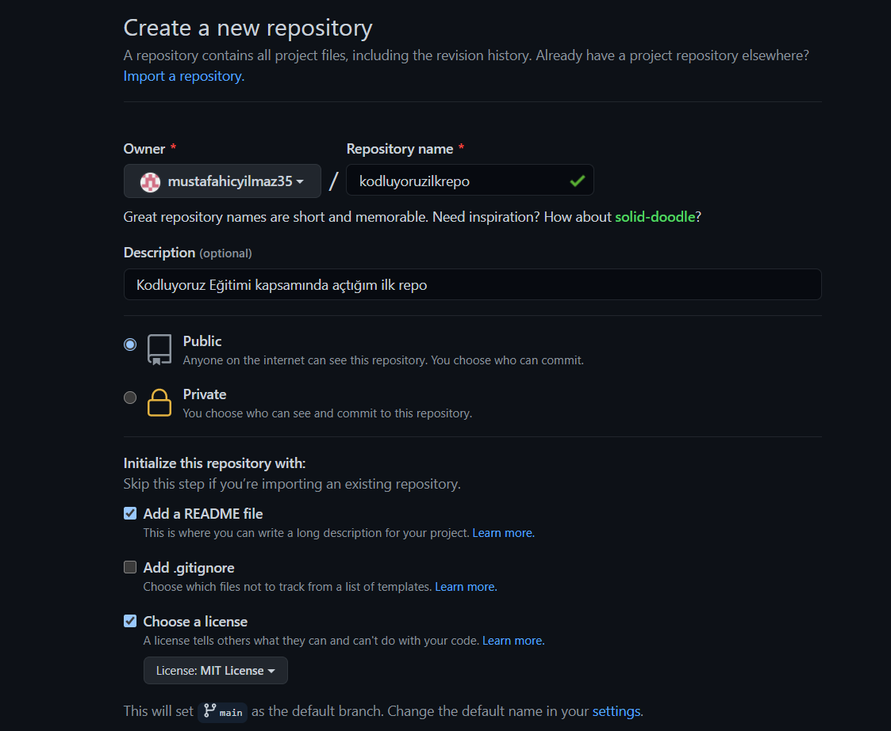

# Kodluyoruz İlk Repo

Bu repo [kodluyoruz](https://www.kodluyoruz.org/) Front-End eğitiminde oluşturduğumuz ilk repo. İçerisinde bir adet README dosyası, bir adet de index.html dosyası barındırıyor.

# Installation

Öncelikle projeyi clonelayın.(Buraya sizin reponuzdan aldığınız link gelecek.)

```
get clone https://github.com/mustafahicyilmaz35/kodluyoruzilkrepo.git
```

# Usage

Projeyi cloneladıktan sonra Visual Studio Code ortamında açınız.

Linux için:

```
cd kodluyoruzilkrepo
code .
```
# Contributing

Pull requestler kabul edilir. Büyük değişiklikler için, lütfen neyi değiştimek istediğinizi tartışmak için bir konu açınız.

# License

[MIT](https://choosealicense.com/)



